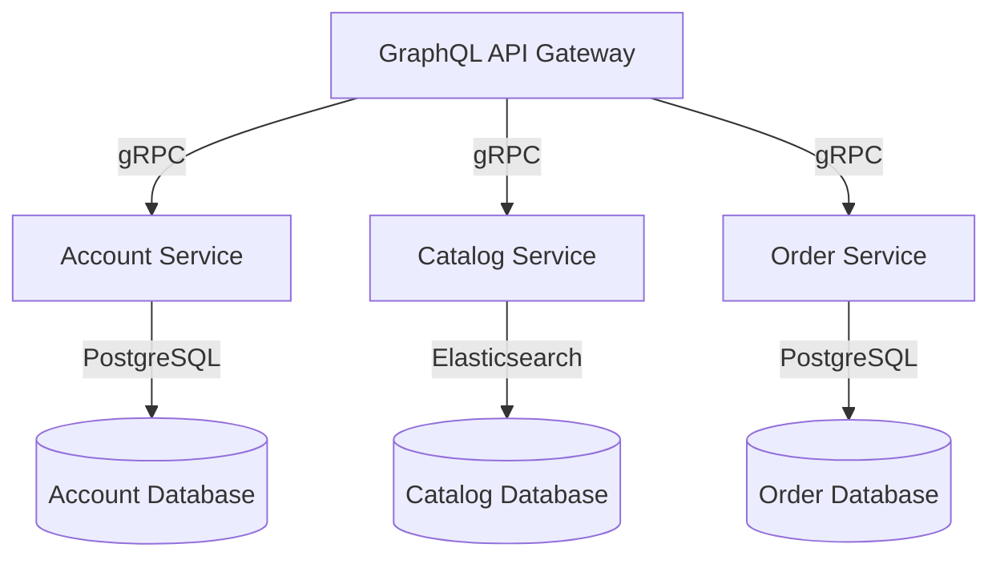

# Gommerz

## Overview
Gommerz is Microservices Project with GraphQL API, PostgreSQL, and grpc

This project demonstrates a microservices architecture using gRPC for inter-service communication and GraphQL as the API gateway. It includes services for account management, product catalog, and order processing.

## Services architecture


## Project Structure

The project consists of the following main components:

- GraphQL API Gateway
- Account Service
- Catalog Service
- Order Service

Each service has its own database:

- Account and Order services use PostgreSQL
- Catalog service uses Elasticsearch

## Installation & Usage
To install Gommerz, follow these steps:

1. Clone the repository:
    ```sh
    git clone https://github.com/zjkung/gommerz.git
    ```
2. Navigate to the project directory:
    ```sh
    cd gommerz
    ```
3. Start the services using docker-compose:
    ```sh
    docker-compose up -d --build
    ```
4. Access the GraphQL playground:
    ```
    http://localhost:8000/playground
    ```
## License
This project is licensed under the MIT License - see the LICENSE file for details.
